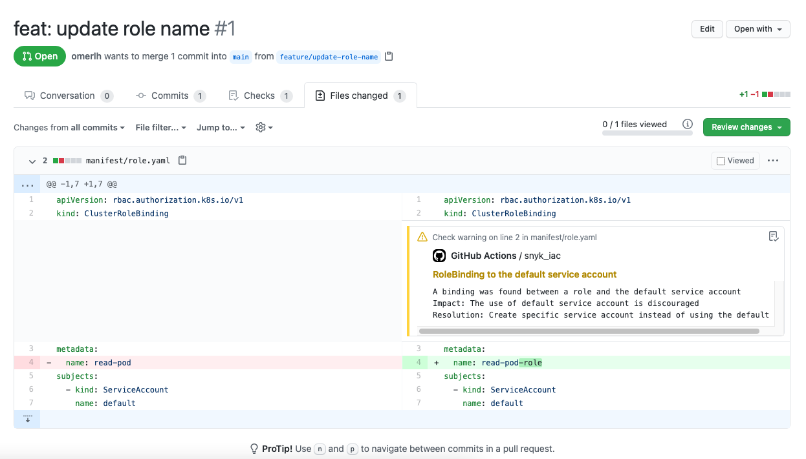

# Snyk IaC PR Annotations 
A POC repo demonstrating how to use [Snyk IaC](https://snyk.io/product/infrastructure-as-code-security/) with your pull requests!

This repo leverages [GitHub actions](https://docs.github.com/en/actions) to annotate your PR with Snyk IaC findings:

Checkout the [Example PR](https://github.com/snyk-labs/snyk-iac-pr-annotations/pull/1) to view it live :)

## Usage

* First, you'll need your Snyk API token. See this [Guide](https://support.snyk.io/hc/en-us/articles/360004008278-Revoking-and-regenerating-Snyk-API-tokens) to learn how to get it.
* Create a new [secret](https://docs.github.com/en/actions/reference/encrypted-secrets#creating-encrypted-secrets-for-a-repository) in your repository. The name should be "SNYK_TOKEN" and the value - the token from previous step.
* Copy all the files from this repo - and you're done! 
